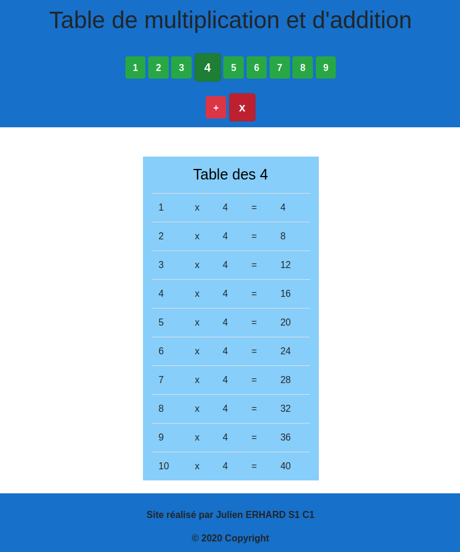

  <h3 align="center">Table de multiplication et d'addition</h3>

  
Page web qui permet à l'utilisateur de réviser ses tables de multiplication et d'addition.
      
    <a href="#installation"><b>INSTALLATION INSTRUCTIONS</b></a>
  

## Table des matières
* [Aperçu](##aperçu)
* [À propos du projet](#à-propos-du-projet)
* [Installation](#installation)
* [Conditions préalables](#condition-préalable)

## Aperçu

Voici l'aperçu du site web: 

  

